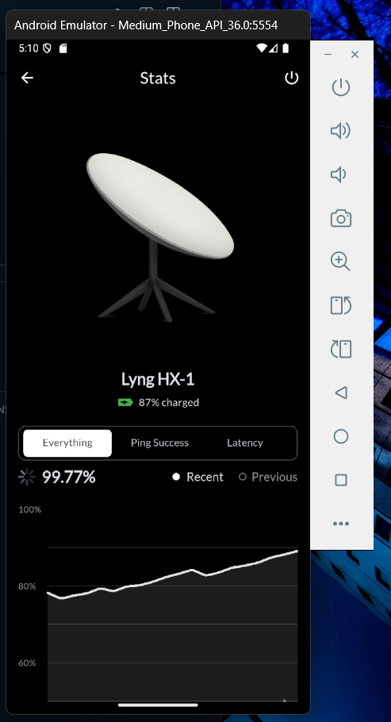
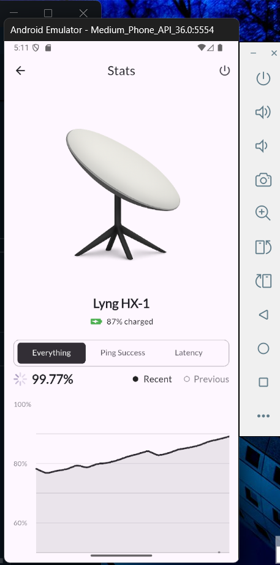

# 📡 Satellite ISP Dashboard UI

A sleek and responsive **Flutter UI** for visualizing Internet Service Provider (ISP) analytics such as ping success rate, latency, uptime, and bandwidth.

This project focuses on a clean user interface and dark mode support

---

## Features

- 📊 Custom tabbed analytics view (`Everything`, `Ping Success`, `Latency`, etc.)
- 🔋 Rotated horizontal battery status indicator
- 📈 Smooth line chart visualization using `fl_chart`
- 🌙 Dark mode enabled by default
- 📱 Fully responsive layout using Flutter widgets

---

## Getting Started

### Prerequisites

- Flutter SDK (>=3.x)
- Dart SDK
- Android Studio or Visual Studio Code
- A connected device or emulator

### Installation

1. **Clone the repository**

   ```bash
   git clone https://github.com/nyarko-i/satlliteUI
   cd satellite
   ```

2. **Install dependencies**

   ```bash
   flutter pub get
   ```

3. **Run the app**

   ```bash
   flutter run
   ```

---

## 📁 Project Structure

```text
lib/
├── main.dart              # Entry point of the app
├── home_page.dart         # Main dashboard screen
├── analytics_chart.dart   # Line chart widget using fl_chart
assets/
└── dish.png               # Header image asset
```

---

## Dependencies

- [fl_chart](https://pub.dev/packages/fl_chart) – for line chart visualizations
- [google_fonts](https://pub.dev/packages/google_fonts) – for modern, clean font styles

---

## Customization

You can:

- Add real-time data to `AnalyticsChart` using a stream or API.
- Adjust tab labels or themes.
- Replace the static battery icon with a dynamic one based on system info.

---

## Screenshots

### 🌙 Dark Mode



### ☀️ Light Mode



---

## 🧑‍💻 Author

**Isaac Nyarko**

---
